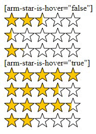

## Reating Star

[LICENSE](LICENSE)

[View Demo](https://amurkhoyetsyan.github.io/stars-reating/)

 

 

concat js file

    
    
or

    
    
    
### Attribute

| Attribute             | Value         | Type    | Require                 |
|-----------------------|---------------|---------| ----------------------- |
| arm-star-data-percent | 0-100         | Number  |    :heavy_check_mark:   |
| arm-star-is-hover     | true or false | Boolean |    :x:                  |

### Default Options

    {
        width: 15,
        count: 5,
        strokeWidth: 1,
        stroke: 'rgba(0,0,0,1)',
        starColor: 'rgb(255,200,0)',
        starEmptyColor: '#FFFFFF',
        points: 5,
        onclick: function(starIndex, index) {
            console.log('clicked', starIndex, index)
        }
    }

### Example for pure js

    

    

    

    

    

    

    

    
    
